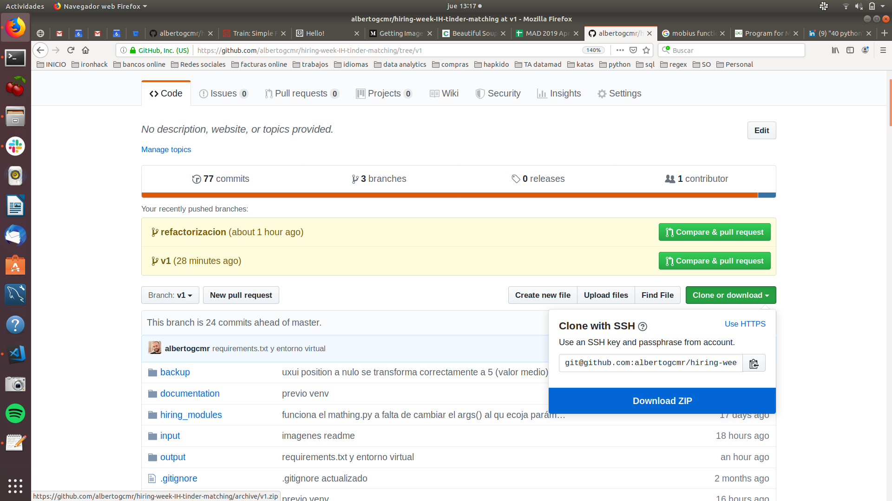
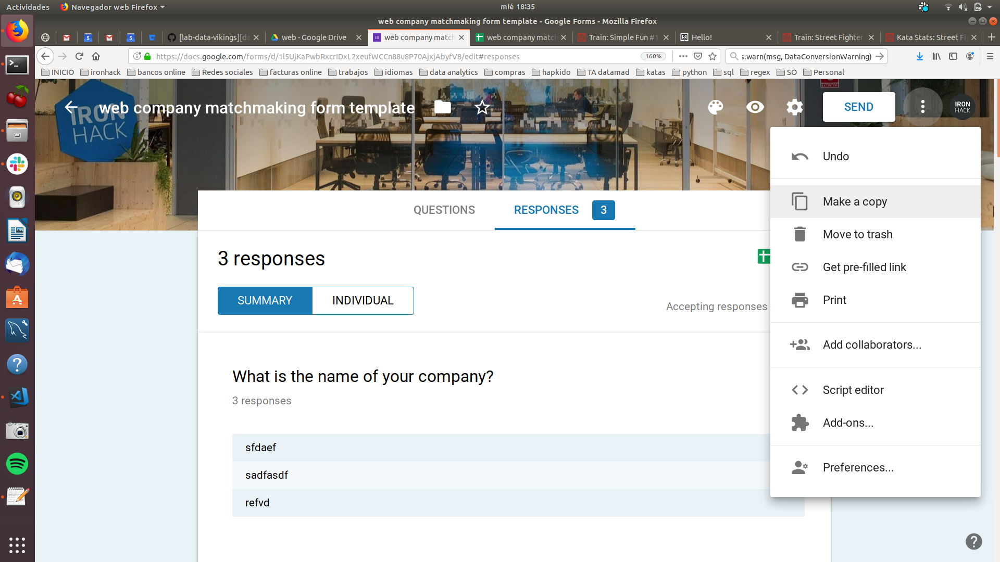
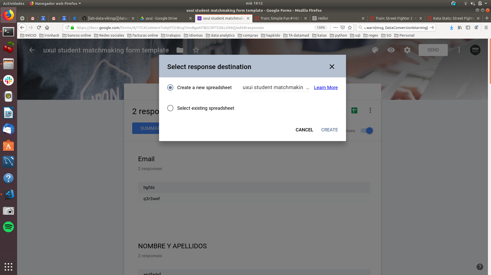
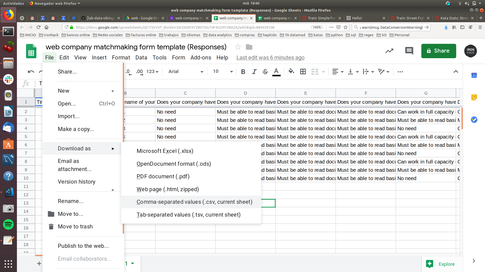
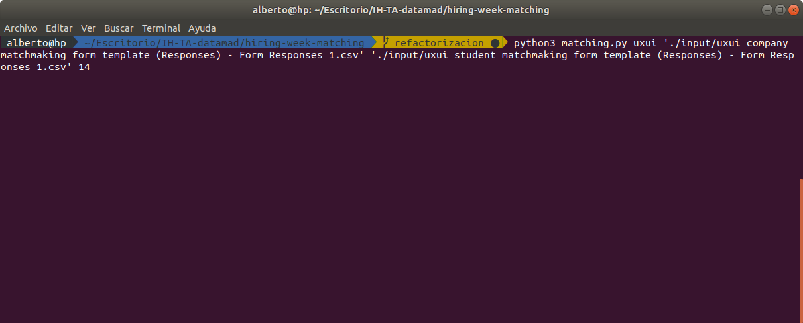

# Tinder for companies

Script for the Outcomes area of ​​Ironhack. It allows creating pairing rounds between companies and students giving priority to those of greater affinity (matching) between student and company and ensuring that all students have a similar number of interviews.
This script uses python 3 and several libraries that will be automatically installed by using the command line.


## Sources of survey templates


### WEB
Student survey template: 
* https://docs.google.com/forms/d/1vQAJSoG8WTs4EY9hCC6JX7MxA8bs--PKAhCxg5v8gMs/edit

Company survey template:
* https://docs.google.com/forms/d/1EqQLmBmdHEqvbABS9dspmBaBSFVq0HKYCcNYkkTrSVc/edit

### UXUI
Student survey template: 
* https://docs.google.com/forms/d/1KrLeeJ7x66drtw9w04ypmlik60vNF-rwluqr-JQt6BY/edit

Company survey template:
* https://docs.google.com/forms/d/1ia6RABfPYULkvTG0cojDZtZca0iTMn6_UfT4NqgHo6Q/edit

### Data 
Student survey template: 
* TO DO

Company survey template:
* TO DO


## Instructions
0. Copy the project to your computer from the github link in the location of your choice: 
    * https://github.com/albertogcmr/hiring-week-IH-tinder-matching/tree/v1 



1. Copy both forms from the original source: 
    * Copy student survey template
	* Copy company survey template

    
2. Send the corresponding survey to the students and companies that participate in the hiring fair. 
3. Once the forms are completed generate the spreadsheets provided by google. 
    * When it is the first time:  
    * If it has already been created previously: 
4. Download both spreadsheets in CSV format: 
5. Copy both CSVs into the project's input folder. 
6. Opent the terminal and install the dependencies: 
``` 
$ virtualenv venv 
$ . venv/bin/activate
$ pip install -r requirements.txt
```
7. Execute the following instruction in the terminal. For example: 
```
$ python3 matching.py uxui './input/uxui company matchmaking form template (Responses) - Form Responses 1.csv' './input/uxui student matchmaking form template (Responses) - Form Responses 1.csv' 14
```
Being: 

    * python3 = Python program
    * matching.py = Name of the script
    * './input/uxui company matchmaking form template (Responses) - Form Responses 1.csv' = CSV path of companies
    * './input/uxui student matchmaking form template (Responses) - Form Responses 1.csv' = CSV step of students
    * 14 = Number of rounds desired

8. An excel file called **output.xlsx** containing the results of the calculated pairings will be generated in the output folder.

## Future improvements

DONE