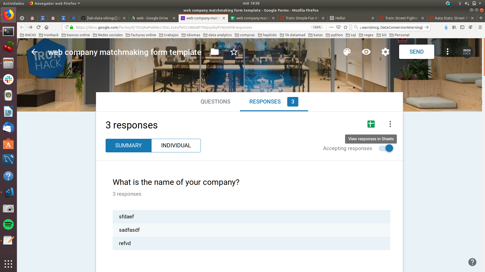

# Tinder para empresas

Script para el area de Outcomes de Ironhack. Permite crear rondas de emparejamiento entre empresas y estudiantes dando prioridad a las de mayor afinididad (matching) entre alumno y empresa y procurando que todos los alumnos tengan un número similar de entrevistas. 
Este script utiliza python 3 y varias librerías. 


## Encuestas Fuente


### WEB
Encuestas Students: 
* https://docs.google.com/forms/d/1vQAJSoG8WTs4EY9hCC6JX7MxA8bs--PKAhCxg5v8gMs/edit

Encuestas Company: 
* https://docs.google.com/forms/d/1EqQLmBmdHEqvbABS9dspmBaBSFVq0HKYCcNYkkTrSVc/edit

### UXUI
Encuestas Students: 
* https://docs.google.com/forms/d/1KrLeeJ7x66drtw9w04ypmlik60vNF-rwluqr-JQt6BY/edit

Encuestas Company: 
* https://docs.google.com/forms/d/1ia6RABfPYULkvTG0cojDZtZca0iTMn6_UfT4NqgHo6Q/edit

### Data 
Encuestas Students: 
* TO DO

Encuestas Company: 
* TO DO

## TO DO
el uxui se elegen 3 competencias y no te calificas en cada una. 

## Instrucciones
1. Copiar ambos formularios desde la fuente original: 


	1. students form (URL_1)
	2. companies form (URL_2)
2. Enviar a los estudiantes y a las empresas que participan en la hiring fair su encuesta correspondiente. Mas detallado
3. Una vez que los formularios estén terminados generar la hoja de cálculo que proporciona google. 
    1. Si es la primera vez:  

    2. Si ya se ha creado previamente: 

4. descargar ambos excel en formato CSV 
5. copiar ambos csv en la carpeta input del proyecto


6. Instalar dependencias desde la terminal: 
``` 
$ virtualenv venv 
$ . venv/bin/activate
$ pip install -r requirements.txt
$ make
$ python app.py
```
7. Ejecutar la siguiente instrucción en la terminal. Por ejemplo: 

```
$> python3 matching.py uxui './input/uxui company matchmaking form template (Responses) - Form Responses 1.csv' './input/uxui student matchmaking form template (Responses) - Form Responses 1.csv' 14
```
Siendo: 
```
* python3 = programa python
* matching.py = nombre del script
* './input/uxui company matchmaking form template (Responses) - Form Responses 1.csv' = ruta del csv de empresas
* './input/uxui student matchmaking form template (Responses) - Form Responses 1.csv' = ruta del csv de estudiantes
* 14 = Número de rondas deseadas
```

## Mejoras. Reunión outcomes

DONE